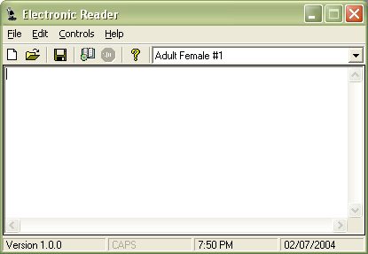



## Electronic Reader 1\.0

### Description

Well this be the best submission by me! It is a complete text to voice software using Agent control 2.0. It does not use any Microsoft characters. The 10 voice types availabe are designed by me using Agent Character Editor. It is well designed with a professional look. You must have Lernout & Hauspie(r)Truvoice TTS Engine - American English which can be downloaded for free from http://www.microsoft.com/msagent/downloads/user.asp#tts

Please vote if you think it helped in anyway...
 
### More Info
 

             |
---                |---
**Submitted On**   |2004-07-02 21:00:06
**By**             |[kertz](https://github.com/Planet-Source-Code/PSCIndex/blob/master/ByAuthor/kertz.md)
**Level**          |Intermediate
**User Rating**    |4.2 (25 globes from 6 users)
**Compatibility**  |VB 6\.0
**Category**       |[Complete Applications](https://github.com/Planet-Source-Code/PSCIndex/blob/master/ByCategory/complete-applications__1-27.md)
**World**          |[Visual Basic](https://github.com/Planet-Source-Code/PSCIndex/blob/master/ByWorld/visual-basic.md)
**Archive File**   |[Electronic176618752004\.zip](https://github.com/Planet-Source-Code/kertz-electronic-reader-1-0__1-54771/archive/master.zip)

